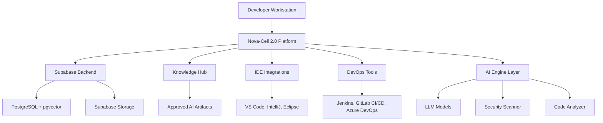

# Nova-Cell 2.0 Developer Guide

<div class="nova-card">
  <div class="nova-accent-border">
    <h2>🚀 Plataforma de Desarrollo Aumentado con IA</h2>
    <p>Guía técnica completa para desarrolladores usando Nova-Cell 2.0, la plataforma corporativa de desarrollo asistido por IA del banco, con integración completa al ecosistema de gobernanza del CoE IA.</p>
  </div>
</div>

## 📖 Tabla de Contenidos

1. [Introducción a Nova-Cell 2.0](#introducción-a-nova-cell-20)
2. [Getting Started](#getting-started)
3. [Core Features](#core-features)
4. [Integración con IDEs](#integración-con-ides)
5. [APIs y SDKs](#apis-y-sdks)
6. [Mejores Prácticas](#mejores-prácticas)
7. [Casos de Uso Avanzados](#casos-de-uso-avanzados)
8. [Troubleshooting](#troubleshooting)

## 🏗️ Introducción a Nova-Cell 2.0

### Arquitectura de la Plataforma

Nova-Cell 2.0 está construida sobre una arquitectura modular y escalable que garantiza alta disponibilidad y cumplimiento regulatorio:



### Componentes Principales

| Componente | Descripción | Tecnología |
|------------|-------------|------------|
| **AI Engine** | Motor de IA para generación y análisis de código | GPT-4, Codex, Custom Models |
| **Integration Layer** | Capa de integración con herramientas externas | REST APIs, WebSockets |
| **Governance Module** | Validación de cumplimiento y políticas | ISO 42001, PCI DSS validators |
| **Storage Backend** | Almacenamiento seguro de artefactos | Supabase (PostgreSQL + pgvector) |
| **User Interface** | Interfaces de usuario para desarrolladores | CLI, IDE Plugins, Web UI |

### Casos de Uso de Desarrollo Aumentado

!!! success "Productividad Mejorada"
    - **40% reducción** en tiempo de desarrollo
    - **60% menos** bugs en producción
    - **2.1x productividad** en squads aumentados

### Beneficios para Desarrolladores

- **Generación Inteligente**: Código optimizado para estándares bancarios
- **Seguridad Integrada**: Validación automática contra PCI DSS y OWASP
- **Documentación Automática**: Genera docs en OpenAPI, Swagger, Markdown
- **Refactoring Asistido**: Modernización de legacy code con IA

## 🚀 Getting Started

### Requisitos del Sistema

```yaml
system_requirements:
  os:
    - Windows 10+ (Build 19041+)
    - macOS 11+ (Big Sur)
    - Linux Ubuntu 20.04+ / RHEL 8+
  hardware:
    ram: 8GB minimum (16GB recommended)
    disk: 10GB free space
    cpu: 4 cores minimum
  software:
    node: v16.0.0+
    docker: v20.10+
    git: v2.30+
  network:
    vpn: Bank internal VPN required
    bandwidth: 10 Mbps minimum
```

### Instalación y Configuración

#### 1. Instalación del CLI

```bash
# Instalación global via npm (desde registro interno)
npm config set registry https://npm.novasolutionsystems.com
npm install -g @banco/nova-cell-cli

# Verificar instalación
nova-cell --version
# Output: Nova-Cell CLI v2.0.3

# Configurar variables de entorno
export NOVA_CELL_API_URL=https://nova-cell.novasolutionsystems.com/api/v1
export NOVA_CELL_ENV=production
```

#### 2. Autenticación SSO

```bash
# Login con credenciales corporativas
nova-cell auth login --sso

# El browser abrirá para autenticación
# Callback URL: https://nova-cell.novasolutionsystems.com/auth/callback

# Verificar autenticación
nova-cell auth status
# Output: Authenticated as: juan.perez@novasolutionsystems.com (Developer)
# Token expires: 2025-01-10 18:00:00
```

#### 3. Configuración del Workspace

```bash
# Crear nuevo proyecto
nova-cell init my-banking-app --template microservice-java

# Estructura generada:
# my-banking-app/
# ├── .nova-cell/
# │   ├── config.yaml
# │   └── prompts/
# ├── src/
# │   ├── main/
# │   └── test/
# ├── docker/
# ├── k8s/
# └── README.md

# Configurar nivel de compliance
nova-cell config set compliance.level "PCI-DSS-4.0"
nova-cell config set security.scan.enabled true
nova-cell config set governance.validate true
```

### Primer Proyecto con Nova-Cell

#### Ejemplo: API REST para Gestión de Cuentas

```bash
# Generar scaffold de API
nova-cell generate api \
  --name account-management \
  --type rest \
  --lang java \
  --framework spring-boot \
  --compliance PCI-DSS

# Output:
# ✓ Validating against governance policies...
# ✓ Pulling approved template from Knowledge Hub...
# ✓ Generating project structure...
# ✓ Installing dependencies...
# ✓ Running security scan...
# Project created successfully!
```

#### Código Generado (Ejemplo)

```java
// src/main/java/mx/banco/accounts/controller/AccountController.java
@RestController
@RequestMapping("/api/v1/accounts")
@Validated
@SecurityRequirement(name = "bearerAuth")
public class AccountController {
    
    private final AccountService accountService;
    private final AuditLogger auditLogger;
    
    @PostMapping
    @RateLimit(value = 100, duration = "1m")
    @ComplianceCheck(standard = "PCI-DSS")
    public ResponseEntity<AccountResponse> createAccount(
            @Valid @RequestBody AccountRequest request,
            @AuthenticationPrincipal UserDetails user) {
        
        // Nova-Cell generated: Audit logging for compliance
        auditLogger.log(AuditEvent.ACCOUNT_CREATION, user, request);
        
        // Nova-Cell generated: Input validation per PCI DSS
        validateAccountRequest(request);
        
        Account account = accountService.create(request);
        return ResponseEntity.ok(AccountResponse.from(account));
    }
}
```

## 💡 Core Features

### Code Generation & Completion

#### Generación de Código con Contexto Bancario

```bash
# Generar función para validación de CLABE
nova-cell generate code \
  --prompt "Función para validar CLABE interbancaria mexicana" \
  --lang python \
  --context banking

# Output generado:
```

```python
import re
from typing import bool, Optional

def validate_clabe(clabe: str) -> tuple[bool, Optional[str]]:
    """
    Valida una CLABE interbancaria mexicana (18 dígitos).
    
    Args:
        clabe: String con la CLABE a validar
        
    Returns:
        Tupla (es_valida, mensaje_error)
    
    Compliance: CNBV Circular 3/2012
    """
    # Nova-Cell: Validación de formato básico
    if not clabe or not re.match(r'^\d{18}$', clabe):
        return False, "CLABE debe tener exactamente 18 dígitos"
    
    # Nova-Cell: Validación de banco (primeros 3 dígitos)
    banco_code = clabe[:3]
    if banco_code not in BANCOS_AUTORIZADOS:
        return False, f"Código de banco {banco_code} no autorizado"
    
    # Nova-Cell: Algoritmo de verificación módulo 10
    weights = [3, 7, 1] * 6
    check_sum = sum(int(d) * w for d, w in zip(clabe[:17], weights[:17])) % 10
    expected_digit = (10 - check_sum) % 10
    
    if int(clabe[17]) != expected_digit:
        return False, "Dígito verificador inválido"
    
    return True, None

# Constantes de bancos autorizados por CNBV
BANCOS_AUTORIZADOS = {
    '002', '006', '009', '012', '014', '019', '021', '030',
    '032', '036', '037', '042', '044', '058', '059', '060'
    # ... lista completa
}
```

### Automated Testing

#### Generación Automática de Tests

```bash
# Generar tests para servicio
nova-cell test generate \
  --file src/main/java/TransactionService.java \
  --framework junit5 \
  --coverage 80

# Configuración de test generation
```

```yaml
# .nova-cell/test-config.yaml
test_generation:
  framework: junit5
  coverage_target: 80
  include_edge_cases: true
  include_security_tests: true
  mock_framework: mockito
  patterns:
    - happy_path
    - error_handling
    - boundary_values
    - security_vulnerabilities
```

#### Ejemplo de Test Generado

```java
@ExtendWith(MockitoExtension.class)
class TransactionServiceTest {
    
    @Mock
    private TransactionRepository repository;
    
    @InjectMocks
    private TransactionService service;
    
    @Test
    @DisplayName("Should process valid transaction successfully")
    void processTransaction_ValidInput_Success() {
        // Nova-Cell generated: Happy path test
        Transaction transaction = TransactionBuilder.valid().build();
        when(repository.save(any())).thenReturn(transaction);
        
        TransactionResult result = service.process(transaction);
        
        assertAll(
            () -> assertEquals(PROCESSED, result.getStatus()),
            () -> assertNotNull(result.getTransactionId()),
            () -> verify(repository).save(transaction)
        );
    }
    
    @Test
    @DisplayName("Should reject transaction exceeding daily limit")
    void processTransaction_ExceedsDailyLimit_Rejected() {
        // Nova-Cell generated: Business rule validation
        Transaction transaction = TransactionBuilder
            .withAmount(1_000_001.00) // Exceeds daily limit
            .build();
        
        assertThrows(
            DailyLimitExceededException.class,
            () -> service.process(transaction)
        );
    }
}
```

### Code Review & Security Scanning

#### Escaneo de Seguridad Integrado

```bash
# Escaneo completo de seguridad
nova-cell security scan \
  --project . \
  --standard "PCI-DSS,OWASP-Top10" \
  --output json > security-report.json

# Ejemplo de output
```

```json
{
  "scan_id": "scan_20250110_143022",
  "status": "completed",
  "findings": [
    {
      "severity": "HIGH",
      "type": "SQL_INJECTION",
      "file": "src/main/java/UserDAO.java",
      "line": 45,
      "description": "Potential SQL injection vulnerability",
      "recommendation": "Use parameterized queries",
      "compliance_impact": ["PCI-DSS-6.5.1"],
      "nova_cell_fix": {
        "available": true,
        "command": "nova-cell fix apply --issue scan_20250110_143022_001"
      }
    }
  ],
  "summary": {
    "total_issues": 3,
    "critical": 0,
    "high": 1,
    "medium": 2,
    "low": 0
  }
}
```

### Documentation Generation

#### Generación Automática de Documentación

```bash
# Generar documentación OpenAPI
nova-cell docs generate \
  --type openapi \
  --source src/main/java \
  --output docs/api.yaml \
  --include-examples true
```

```yaml
# Output: docs/api.yaml
openapi: 3.0.3
info:
  title: Account Management API
  version: 1.0.0
  description: |
    API para gestión de cuentas bancarias.
    Generado por Nova-Cell 2.0
  contact:
    name: CoE IA - Banco
    email: coe-ia@novasolutionsystems.com
servers:
  - url: https://api.novasolutionsystems.com/v1
    description: Production
security:
  - bearerAuth: []
paths:
  /accounts:
    post:
      summary: Crear nueva cuenta
      operationId: createAccount
      tags:
        - Accounts
      requestBody:
        required: true
        content:
          application/json:
            schema:
              $ref: '#/components/schemas/AccountRequest'
            examples:
              savings_account:
                value:
                  account_type: "SAVINGS"
                  initial_deposit: 1000.00
                  currency: "MXN"
      responses:
        '201':
          description: Cuenta creada exitosamente
          content:
            application/json:
              schema:
                $ref: '#/components/schemas/AccountResponse'
```

## 🔧 Integración con IDEs

### VS Code Extension

#### Instalación y Configuración

```json
// .vscode/settings.json
{
  "nova-cell.enabled": true,
  "nova-cell.api.endpoint": "https://nova-cell.novasolutionsystems.com/api/v1",
  "nova-cell.auth.method": "sso",
  "nova-cell.compliance.level": "high",
  "nova-cell.features": {
    "codeCompletion": true,
    "securityScanning": true,
    "documentationGeneration": true,
    "refactoring": true
  },
  "nova-cell.shortcuts": {
    "generateCode": "Ctrl+Shift+G",
    "scanSecurity": "Ctrl+Shift+S",
    "generateTests": "Ctrl+Shift+T"
  }
}
```

#### Características del Plugin

- **IntelliSense Aumentado**: Sugerencias contextuales basadas en patrones bancarios
- **Security Linting**: Alertas en tiempo real sobre vulnerabilidades
- **Quick Actions**: Generación rápida de código con `Ctrl+.`
- **Snippet Library**: Acceso a snippets aprobados del Knowledge Hub

### IntelliJ IDEA Plugin

```xml
<!-- .idea/nova-cell.xml -->
<component name="NovaCellSettings">
  <option name="enabled" value="true"/>
  <option name="apiEndpoint" value="https://nova-cell.novasolutionsystems.com/api/v1"/>
  <option name="complianceLevel" value="PCI-DSS"/>
  <option name="features">
    <feature name="smartCompletion" enabled="true"/>
    <feature name="securityInspection" enabled="true"/>
    <feature name="refactoringAssistant" enabled="true"/>
  </option>
</component>
```

### CLI Tools

#### Comandos Principales

```bash
# Comandos de generación
nova-cell generate <type> [options]
  api           # Generar API REST/GraphQL
  service       # Generar servicio/microservicio
  model         # Generar modelos de datos
  test          # Generar tests
  docs          # Generar documentación

# Comandos de análisis
nova-cell analyze <target> [options]
  security      # Análisis de seguridad
  performance   # Análisis de performance
  complexity    # Análisis de complejidad
  dependencies  # Análisis de dependencias

# Comandos de refactoring
nova-cell refactor <type> [options]
  legacy        # Modernizar código legacy
  microservice  # Extraer microservicio
  pattern       # Aplicar patrón de diseño
  optimize      # Optimizar performance

# Comandos de gestión
nova-cell config <action> [key] [value]
nova-cell auth <action>
nova-cell cache <action>
nova-cell artifact <action>
```

## 🔌 APIs y SDKs

### REST API Reference

#### Endpoints Principales

```http
# Autenticación
POST /api/v1/auth/token
Authorization: Bearer <sso_token>

# Generación de código
POST /api/v1/generate/code
Content-Type: application/json
Authorization: Bearer <jwt_token>

{
  "prompt": "Create transaction validator service",
  "language": "java",
  "framework": "spring-boot",
  "context": {
    "domain": "payments",
    "compliance": ["PCI-DSS", "ISO-27001"]
  }
}

# Response
{
  "request_id": "req_abc123",
  "status": "completed",
  "code": "...",
  "metadata": {
    "lines_generated": 156,
    "compliance_checks": "passed",
    "security_score": 98
  }
}
```

### Python SDK

```python
# Installation
pip install nova-cell-sdk --index-url https://pypi.novasolutionsystems.com

# Usage
from nova_cell import NovaCellClient
from nova_cell.models import GenerateRequest, ComplianceLevel

# Initialize client
client = NovaCellClient(
    api_key=os.getenv("NOVA_CELL_API_KEY"),
    base_url="https://nova-cell.novasolutionsystems.com/api/v1"
)

# Generate code
request = GenerateRequest(
    prompt="Create a function to calculate compound interest",
    language="python",
    compliance_level=ComplianceLevel.HIGH,
    context={
        "domain": "lending",
        "regulations": ["CNBV", "CONDUSEF"]
    }
)

response = client.generate_code(request)
print(f"Generated {response.lines_count} lines of code")
print(f"Security score: {response.security_score}/100")

# Save to file
with open("interest_calculator.py", "w") as f:
    f.write(response.code)
```

### Java SDK

```java
// Maven dependency
<dependency>
    <groupId>mx.banco.novacell</groupId>
    <artifactId>nova-cell-sdk</artifactId>
    <version>2.0.3</version>
</dependency>

// Usage
import mx.banco.novacell.NovaCellClient;
import mx.banco.novacell.models.*;

public class Example {
    public static void main(String[] args) {
        // Initialize client
        NovaCellClient client = NovaCellClient.builder()
            .apiKey(System.getenv("NOVA_CELL_API_KEY"))
            .baseUrl("https://nova-cell.novasolutionsystems.com/api/v1")
            .build();
        
        // Generate service
        ServiceGenerationRequest request = ServiceGenerationRequest.builder()
            .name("PaymentValidationService")
            .type(ServiceType.REST_API)
            .framework("spring-boot")
            .compliance(Arrays.asList("PCI-DSS", "ISO-27001"))
            .build();
        
        ServiceGenerationResponse response = client.generateService(request);
        
        // Save generated files
        response.getFiles().forEach(file -> {
            Path path = Paths.get(file.getPath());
            Files.write(path, file.getContent().getBytes());
        });
    }
}
```

### JavaScript/TypeScript SDK

```typescript
// Installation
npm install @banco/nova-cell-sdk

// Usage
import { NovaCellClient, GenerationType } from '@banco/nova-cell-sdk';

const client = new NovaCellClient({
  apiKey: process.env.NOVA_CELL_API_KEY,
  baseUrl: 'https://nova-cell.novasolutionsystems.com/api/v1'
});

// Generate React component
async function generateComponent() {
  const response = await client.generate({
    type: GenerationType.COMPONENT,
    prompt: 'Create account balance display component',
    framework: 'react',
    typescript: true,
    styling: 'tailwind',
    compliance: {
      accessibility: 'WCAG-2.1-AA',
      security: 'OWASP'
    }
  });
  
  console.log(`Generated component: ${response.componentName}`);
  console.log(`Files created: ${response.files.length}`);
  
  // Save files
  for (const file of response.files) {
    await fs.writeFile(file.path, file.content);
  }
}
```

### Webhooks y Events

```javascript
// Webhook configuration
const webhookConfig = {
  url: 'https://your-service.novasolutionsystems.com/webhooks/nova-cell',
  events: [
    'code.generated',
    'security.scan.completed',
    'review.finished',
    'deployment.ready'
  ],
  secret: process.env.WEBHOOK_SECRET
};

// Register webhook
await client.webhooks.create(webhookConfig);

// Handle webhook events
app.post('/webhooks/nova-cell', (req, res) => {
  const signature = req.headers['x-nova-cell-signature'];
  
  if (!verifySignature(req.body, signature, webhookSecret)) {
    return res.status(401).send('Invalid signature');
  }
  
  const event = req.body;
  
  switch(event.type) {
    case 'code.generated':
      console.log(`Code generated: ${event.data.requestId}`);
      // Trigger CI/CD pipeline
      break;
    
    case 'security.scan.completed':
      if (event.data.criticalIssues > 0) {
        // Block deployment
        notifySecurityTeam(event.data);
      }
      break;
  }
  
  res.status(200).send('OK');
});
```

## 🎯 Mejores Prácticas

### Prompt Engineering para Desarrollo

#### Estructura de Prompts Efectivos

```markdown
# Template de Prompt Efectivo
CONTEXTO: [Dominio bancario específico]
TAREA: [Acción clara y específica]
RESTRICCIONES: [Compliance, performance, seguridad]
FORMATO: [Estructura esperada del output]
EJEMPLOS: [Casos de uso similares]

# Ejemplo Concreto
CONTEXTO: Sistema de pagos internacionales SWIFT
TAREA: Generar validador de mensajes MT103
RESTRICCIONES: 
  - Cumplir con estándar SWIFT 2023
  - Validación en < 100ms
  - Log de auditoría completo
FORMATO: Clase Java con Spring Boot
EJEMPLOS: Validador MT202 existente
```

### Patrones de Uso Efectivo

#### Desarrollo Iterativo con Nova-Cell

```bash
# 1. Generar estructura inicial
nova-cell generate service --name payment-processor

# 2. Añadir lógica de negocio
nova-cell generate code \
  --context "Add payment validation logic" \
  --file src/main/java/PaymentService.java

# 3. Generar tests
nova-cell test generate --file src/main/java/PaymentService.java

# 4. Revisar seguridad
nova-cell security scan --file src/main/java/PaymentService.java

# 5. Optimizar performance
nova-cell optimize --file src/main/java/PaymentService.java

# 6. Generar documentación
nova-cell docs generate --file src/main/java/PaymentService.java
```

### Seguridad y Compliance

#### Configuración de Políticas de Seguridad

```yaml
# .nova-cell/security-policy.yaml
security:
  standards:
    - PCI-DSS-4.0
    - OWASP-Top-10-2023
    - ISO-27001
  
  rules:
    - id: no-hardcoded-secrets
      severity: critical
      action: block
    
    - id: sql-injection-prevention
      severity: high
      action: auto-fix
    
    - id: input-validation
      severity: medium
      action: warn
  
  scanning:
    on_commit: true
    on_pr: true
    scheduled: "0 2 * * *"  # Daily at 2 AM
  
  data_handling:
    pii_detection: true
    encryption_required: true
    anonymization: auto
```

### Performance Optimization

```javascript
// Configuración de caché para mejorar performance
const novaCellConfig = {
  cache: {
    enabled: true,
    ttl: 3600, // 1 hora
    maxSize: '100MB',
    strategy: 'LRU'
  },
  
  batch: {
    enabled: true,
    maxBatchSize: 10,
    timeout: 5000
  },
  
  retry: {
    maxAttempts: 3,
    backoff: 'exponential',
    initialDelay: 1000
  }
};
```

## 🚀 Casos de Uso Avanzados

### Microservicios con Nova-Cell

#### Generación de Arquitectura Completa

```bash
# Generar arquitectura de microservicios
nova-cell generate architecture \
  --name banking-platform \
  --pattern microservices \
  --services "accounts,payments,customers,notifications" \
  --communication async \
  --messaging kafka

# Estructura generada:
# banking-platform/
# ├── services/
# │   ├── accounts-service/
# │   ├── payments-service/
# │   ├── customers-service/
# │   └── notifications-service/
# ├── infrastructure/
# │   ├── docker-compose.yml
# │   ├── kubernetes/
# │   └── terraform/
# ├── api-gateway/
# └── shared-libraries/
```

### CI/CD Pipeline Integration

#### Jenkins Pipeline con Nova-Cell

```groovy
// Jenkinsfile
pipeline {
    agent any
    
    environment {
        NOVA_CELL_API_KEY = credentials('nova-cell-api-key')
    }
    
    stages {
        stage('Code Generation') {
            steps {
                script {
                    sh '''
                        nova-cell generate missing-tests \
                          --coverage-target 80 \
                          --output-dir src/test
                    '''
                }
            }
        }
        
        stage('Security Scan') {
            steps {
                script {
                    def scanResult = sh(
                        script: 'nova-cell security scan --format json',
                        returnStdout: true
                    )
                    
                    def scan = readJSON text: scanResult
                    if (scan.summary.critical > 0) {
                        error("Critical security issues found!")
                    }
                }
            }
        }
        
        stage('Documentation') {
            steps {
                sh 'nova-cell docs generate --type swagger --output docs/'
                publishHTML([
                    reportDir: 'docs',
                    reportFiles: 'api.html',
                    reportName: 'API Documentation'
                ])
            }
        }
    }
}
```

### Database Schema Generation

```sql
-- Comando para generar schema
-- nova-cell generate schema --context "customer accounts" --db postgres

-- Generated: customer_accounts_schema.sql
CREATE SCHEMA IF NOT EXISTS accounts;

-- Nova-Cell generated: Audit table for compliance
CREATE TABLE accounts.audit_log (
    id UUID PRIMARY KEY DEFAULT gen_random_uuid(),
    event_type VARCHAR(50) NOT NULL,
    entity_type VARCHAR(50) NOT NULL,
    entity_id UUID NOT NULL,
    user_id UUID NOT NULL,
    timestamp TIMESTAMPTZ DEFAULT CURRENT_TIMESTAMP,
    details JSONB,
    ip_address INET,
    user_agent TEXT
);

-- Nova-Cell generated: Main accounts table with PCI DSS compliance
CREATE TABLE accounts.accounts (
    id UUID PRIMARY KEY DEFAULT gen_random_uuid(),
    account_number VARCHAR(20) UNIQUE NOT NULL,
    account_type VARCHAR(20) NOT NULL CHECK (account_type IN ('SAVINGS', 'CHECKING', 'CREDIT')),
    customer_id UUID NOT NULL REFERENCES customers.customers(id),
    balance DECIMAL(15,2) NOT NULL DEFAULT 0.00,
    currency CHAR(3) NOT NULL DEFAULT 'MXN',
    status VARCHAR(20) NOT NULL DEFAULT 'ACTIVE',
    created_at TIMESTAMPTZ DEFAULT CURRENT_TIMESTAMP,
    updated_at TIMESTAMPTZ DEFAULT CURRENT_TIMESTAMP,
    -- PCI DSS: Encryption for sensitive data
    encrypted_pin TEXT,
    -- Soft delete for audit trail
    deleted_at TIMESTAMPTZ
);

-- Nova-Cell generated: Indexes for performance
CREATE INDEX idx_accounts_customer_id ON accounts.accounts(customer_id);
CREATE INDEX idx_accounts_status ON accounts.accounts(status) WHERE deleted_at IS NULL;
CREATE INDEX idx_audit_timestamp ON accounts.audit_log(timestamp);

-- Nova-Cell generated: Row Level Security
ALTER TABLE accounts.accounts ENABLE ROW LEVEL SECURITY;

CREATE POLICY account_access_policy ON accounts.accounts
    FOR ALL
    TO authenticated_users
    USING (customer_id = current_setting('app.current_user_id')::UUID);
```

### API Design & Documentation

```yaml
# Comando: nova-cell design api --name customer-onboarding --standard openapi

# Generated: customer-onboarding-api.yaml
openapi: 3.1.0
info:
  title: Customer Onboarding API
  version: 1.0.0
  description: |
    API para onboarding digital de clientes
    Cumple con: KYC, AML, LFPDPPP
  
x-nova-cell:
  generated: "2025-01-10T15:30:00Z"
  compliance:
    - KYC-CNBV
    - AML-GAFI
    - LFPDPPP

paths:
  /onboarding/start:
    post:
      summary: Iniciar proceso de onboarding
      operationId: startOnboarding
      security:
        - OAuth2: [write]
      requestBody:
        required: true
        content:
          application/json:
            schema:
              type: object
              required: [email, phone, consent]
              properties:
                email:
                  type: string
                  format: email
                  x-pii: true
                phone:
                  type: string
                  pattern: '^\+52[0-9]{10}$'
                  x-pii: true
                consent:
                  type: object
                  required: [terms, privacy, marketing]
                  properties:
                    terms:
                      type: boolean
                    privacy:
                      type: boolean
                    marketing:
                      type: boolean
```

## 🔧 Troubleshooting

### Errores Comunes y Soluciones

| Error | Causa | Solución |
|-------|-------|----------|
| `AUTH_FAILED: Token expired` | Token SSO expirado | Ejecutar `nova-cell auth refresh` |
| `ARTIFACT_NOT_FOUND` | Sin permisos en Knowledge Hub | Verificar `department_id` en JWT |
| `COMPLIANCE_VIOLATION` | Código no cumple estándares | Revisar logs: `nova-cell logs --filter compliance` |
| `RATE_LIMIT_EXCEEDED` | Demasiadas peticiones | Implementar caché local o esperar |
| `GENERATION_TIMEOUT` | Prompt muy complejo | Dividir en prompts más pequeños |

### Debugging Tips

```bash
# Habilitar modo debug
export NOVA_CELL_DEBUG=true
nova-cell --log-level debug generate code --prompt "..."

# Ver logs detallados
nova-cell logs --tail 100 --filter error

# Trace de peticiones HTTP
nova-cell --trace generate api --name test

# Validar configuración
nova-cell doctor
# Output:
# ✓ CLI version: 2.0.3
# ✓ API connection: OK
# ✓ Authentication: Valid
# ✓ Knowledge Hub: Accessible
# ✓ Cache: 245 MB used (2.4% of limit)
```

### Performance Issues

#### Optimización de Caché

```bash
# Limpiar caché
nova-cell cache clear

# Actualizar artefactos en caché
nova-cell cache update --type prompts --type templates

# Ver estadísticas de caché
nova-cell cache stats
# Cache Statistics:
# - Total Size: 245 MB / 10 GB
# - Prompts: 1,234 cached
# - Templates: 56 cached
# - Hit Rate: 87%
# - Age: 3 days since last update
```

### FAQ Técnico

!!! question "¿Cómo actualizo un artefacto en Knowledge Hub?"
    ```bash
    nova-cell artifact update \
      --id prompt-123 \
      --file updated-prompt.md \
      --state PENDING_REVIEW
    ```

!!! question "¿Puedo usar Nova-Cell offline?"
    Sí, con caché local sincronizado:
    ```bash
    nova-cell offline enable
    nova-cell cache sync --full
    ```

!!! question "¿Cómo integro Nova-Cell con mi IDE personalizado?"
    Use la REST API directamente o el SDK correspondiente. Consulte la documentación de APIs.

!!! question "¿Qué hacer si el código generado no compila?"
    1. Verificar versión de dependencias
    2. Ejecutar `nova-cell validate --fix`
    3. Reportar al equipo: `nova-cell report issue`

## 📚 Recursos Adicionales

### Enlaces Útiles

- [Knowledge Hub - Catálogo de Artefactos](/knowledge-hub-guide/)
- [Política de Uso Responsable de IA](/governance/politica-uso-responsable-ia/)
- [Operating Model del CoE](/operating-model-coe/)
- [Framework de Métricas IMPACT](/operating-model-coe/#framework-de-metricas-impact)

### Soporte

- **Email**: ai@novasolutionsystems.com
- **Teams**: Canal #nova-cell-devs
- **Wiki Interna**: wiki.novasolutionsystems.com/nova-cell
- **Helpdesk**: Ext. 4242

---

*Nova-Cell 2.0 Developer Guide v2.0.3 | Centro de Excelencia de IA | Última actualización: 10 de enero de 2025*